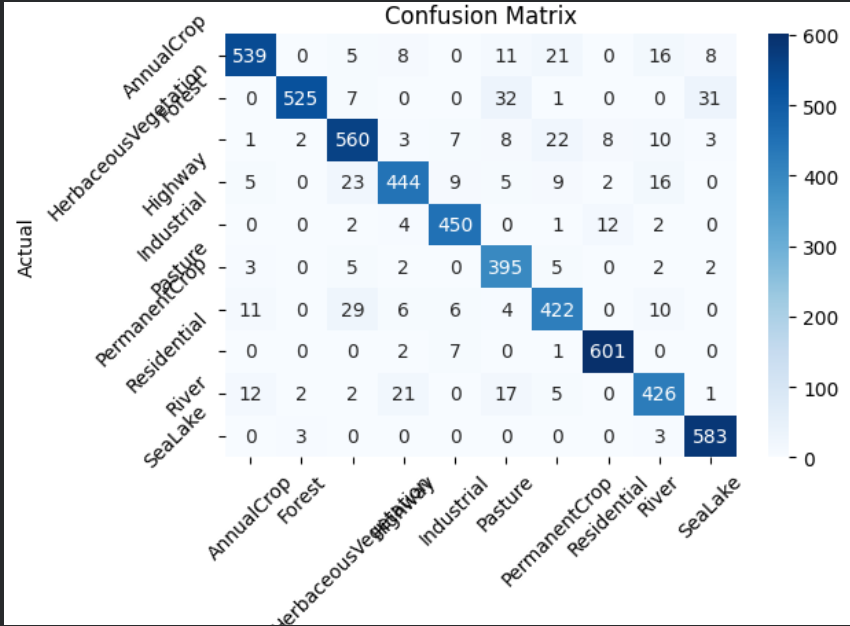
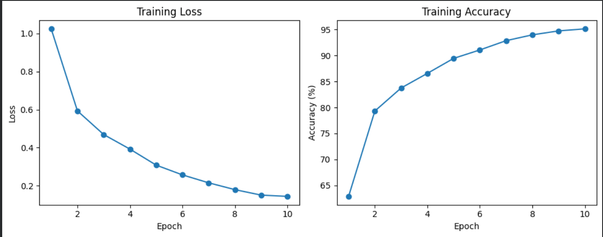
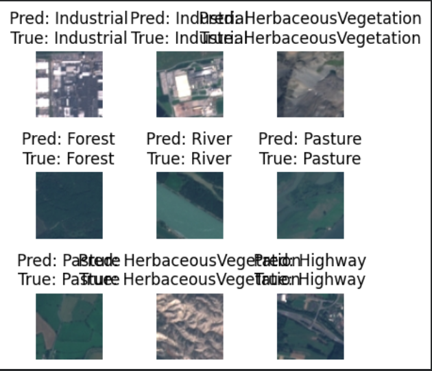

# satellite-image-land-use-classification-cnn
CNN-based satellite image land use classification using the EuroSAT dataset and PyTorch

# Satellite Image Land Use Classification using CNN and PyTorch

## Project Overview

This project uses a Convolutional Neural Network (CNN) built with PyTorch to classify satellite images from the EuroSAT dataset into 10 different land use categories.

The project demonstrates an end-to-end deep learning workflow for satellite image classification using computer vision techniques.

---

## Dataset

Dataset used: EuroSAT Dataset

The dataset contains 27,000 RGB satellite images categorized into 10 land use and land cover classes:

- AnnualCrop
- Forest
- HerbaceousVegetation
- Highway
- Industrial
- Pasture
- PermanentCrop
- Residential
- River
- SeaLake

---

## Technologies Used

- Python
- PyTorch
- CNN (Convolutional Neural Networks)
- Computer Vision
- Remote Sensing
- Matplotlib
- Seaborn
- Scikit-learn

---

## Project Workflow

1. Load and preprocess satellite images
2. Normalize and resize images
3. Split dataset into training and testing sets
4. Build CNN architecture using PyTorch
5. Train the model using GPU acceleration
6. Evaluate model performance
7. Generate confusion matrix and classification report
8. Visualize predictions on test images
9. Save trained model

---

## CNN Architecture

The CNN model contains:

- 3 convolutional layers
- ReLU activation functions
- Max pooling layers
- Dropout regularization
- Fully connected layers for classification

---

## Results

### Final Test Accuracy

91.57%

### Key Observations

- Strong performance on Residential, Industrial, and SeaLake classes
- Minor confusion between visually similar land use categories
- Stable learning behavior observed during training

---

## Training Performance

The model showed consistent improvement during training:

- Training loss steadily decreased
- Training accuracy increased across epochs
- Model converged successfully without unstable behavior

---

## Sample Outputs

### Confusion Matrix



---

### Training Curves



---

### Sample Predictions



---

## Model Saving

The trained model was saved using:

```python
torch.save(model.state_dict(), "satellite_cnn_model.pth")
```

---

## Future Improvements

- Use transfer learning models such as ResNet50
- Add data augmentation techniques
- Improve classification performance on visually similar classes
- Deploy model as a web application

---

## Author

Ish
